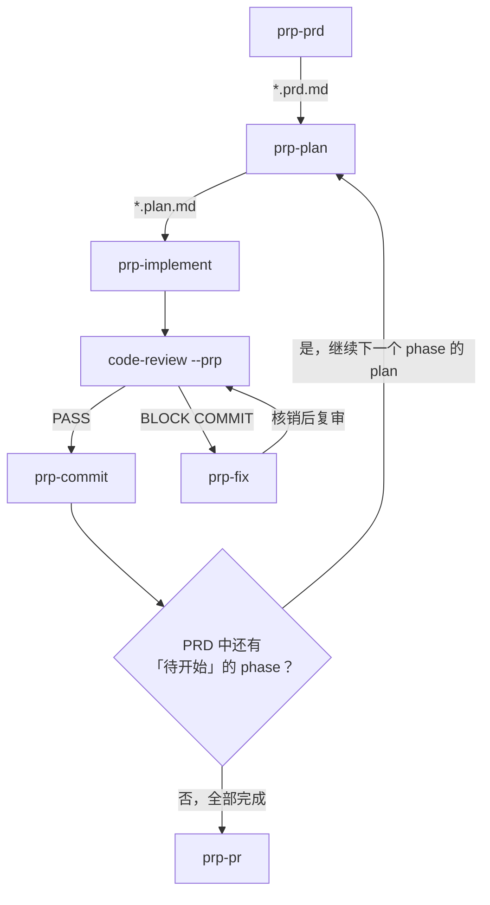

<!-- aimeta3s-doc: command-helper | version: 2 | updated: 2026-08-18 | source: commands/*.md（精确路径见 manifest.json） -->

# aimeta3s 命令使用建议

本指南面向 `commands/` 下的 **42 个命令**。这些命令数量多、族系复杂，单看每个命令文件难以判断"我这个任务到底该用哪条"。本文档把视角从「按命令查」翻转为「按场景用」：

1. 先从命令之间的串联关系抽象出 **9 条流水线**；
2. 再把常见开发场景直接映射到流水线；
3. 每个场景都拆成**阶段/子场景 → 命令**的对应表，不停留在流水线名字上。

> 命令名以 `/` 触发（如 `/plan`）。下文出现的 `→` 表示"上游产物的自然下游"，`|` 表示"二选一/多选一"。

---

## 一、命令总览速查表

按族归类的 42 个命令，每个一句话用途；带 commit 前缀的标注前缀。

### 规划与实施类

/prp-prd 功能/创意描述
/prp-plan .claude/PRPs/prds/{name}.prd.md
/prp-implement .claude/PRPs/plans/{name}.plan.md
/prp-fix [审查报告路径]（留空自动定位最新）
/prp-commit 提交内容描述
/prp-pr base-branch（默认 main）

#### PRP 族
| 命令 | 一句话用途 | 输入 | 输出 |
|---|---|---|---|
| `prp-prd` | 交互式（8 阶段）深度 PRD 生成器，产出分阶段实施表 | 功能/创意描述 | PRD 文件（`.claude/PRPs/prds/{name}.prd.md`） |
| `prp-plan` | 深度代码库分析 + 模式提取，生成自包含实施计划 | PRD 文件（`.claude/PRPs/prds/{name}.prd.md`） | 计划文件（`.claude/PRPs/plans/{name}.plan.md`） |
| `prp-implement` | 按计划落地，每改即验，跑 6 级验证 | 计划文件（`.claude/PRPs/plans/{name}.plan.md`） | 代码 + 测试 + 报告（`.claude/PRPs/reports/{plan-name}-report.md`，计划完成后归档到 `plans/completed/`） |
| `prp-fix` | 按 code-review 审查报告逐项修复并核销（CRITICAL/HIGH 必修，MEDIUM 逐项决策） | 审查报告路径（留空自动定位最新） | 修复核销报告（与源报告同目录 `*-fix-report.md`） |
| `prp-commit` | 自然语言驱动的快速提交（中文描述要提交什么） | 提交内容描述 | git commit 产物 |
| `prp-pr` | 基于未推送 commits 创建 GitHub PR，引用 PRP 产物 | PR 内容描述 | Git PR 产物 |

#### 精简族
| 命令 | 一句话用途 | 输入 | 输出 |
|---|---|---|---|
| `plan-prd` | 精简 | 4 阶段精简 PRD 生成器，只定 what/why，交接给 plan | 功能/创意描述 | PRD 文件（`.claude/prds/{kebab-case-name}.prd.md`） |
| `plan` | 精简 | 重申需求 + 风险评估，产出分步计划，等用户确认才动代码 | 文本（功能/创意描述）/ 计划文件（`.claude/prds/{kebab-case-name}.prd.md`） / 类似prd或自定义格式的md文件 | 输入为`*.prd.md`时，输出`.claude/plans/{kebab-case-name}.plan.md`；其他情况会话中直接输出 |

#### orch 族
| 命令 | 一句话用途 | commit 前缀 |
|---|---|---|
| `orch-add-feature` | 端到端编排：新增全新能力（Research→Plan→TDD→Review→Commit） | `feat:` |
| `orch-build-mvp` | 从设计/规格文档构建可运行 MVP 垂直切片（含 GAN harness） | `feat:` |
| `orch-change-feature` | 把已工作的行为改为新规范（测试先行） | `feat:` |
| `orch-fix-defect` | 用 red test 复现 bug 再修到 green | `fix:` |
| `orch-refine-code` | 保行为重构（以现有测试为安全网） | `refactor:` |

#### 其他
| 命令 | 一句话用途 |
|---|---|
| `feature-dev` | 手动引导式开发：探索→澄清→架构→实现→评审 |
| `build-fix` | 检测构建系统，逐个最小修复构建/类型错误 |
| `plan-canvas` | 浏览器画布评审 plan/HTML artifact：标注元素+聊天+approve/request-changes |

### 审查与质量类

| 命令 | 一句话用途 |
|---|---|
| `code-review` | 总枢：本地未提交变更或 GitHub PR 的全面审查（两模式共用 8 维度清单与统一评级，本地含验证与落盘） |
| `python-review` | Python 专项（PEP 8 / 类型 / 安全 / Pythonic），调 python-reviewer |
| `fastapi-review` | FastAPI 专项（架构/异步/DI/Pydantic/安全），调 fastapi-reviewer |
| `vue-review` | Vue 专项（reactivity/composables/template 安全），调 vue-reviewer + typescript-reviewer |
| `security-scan` | AgentShield 项目级安全扫描（agent/hook/MCP/permission/secret） |
| `test-coverage` | 分析覆盖率差距，生成缺失测试到 80%+ |
| `refactor-clean` | 安全识别并移除死代码，每步删后跑测试 |

### 学习-本能-技能闭环类

| 命令 | 一句话用途 |
|---|---|
| `learn` | 从当前 session 提取可复用模式，存为候选 skill |
| `learn-eval` | learn 的加强版：保存前质量把关 + Global/Project 定位 + 去重裁定 |
| `instinct-status` | 查看 project + global 的 instinct（按 domain 分组、附 confidence） |
| `instinct-export` | 把 instinct 导出到 YAML（团队共享/迁移） |
| `instinct-import` | 从文件或 URL 导入 instinct，按 confidence 合并 |
| `evolve` | 聚类 instinct，升维为 Skill/Command/Agent 候选 |
| `promote` | 把 project scope 的 instinct 提升为 global scope |
| `skill-create` | 分析 git 历史，提取仓库级团队模式生成 SKILL.md |
| `skill-health` | skill 组合健康 dashboard（成功率/失败聚类/版本） |

### 会话、项目与文档类

| 命令 | 一句话用途 |
|---|---|
| `save-session` | 把当前会话状态写入带日期文件，供下次接续 |
| `resume-session` | 加载最近/指定 session，输出 briefing 后等待指令 |
| `sessions` | 会话历史管理面板：list / load / alias / info |
| `projects` | 列出 continuous-learning-v2 注册的项目及 instinct 统计 |
| `update-codemaps` | 扫描项目生成 token-lean 架构代码地图（5 张） |
| `update-docs` | 从代码真相源反向同步文档（scripts/env/CONTRIBUTING/RUNBOOK） |
| `pr` | 从当前分支未推送 commits 创建 PR，引用 plan/prd 产物 |

### GAN 自动生产类

| 命令 | 一句话用途 |
|---|---|
| `gan-build` | GAN 式构建循环（planner→generator→evaluator），功能优先 |
| `gan-design` | GAN 式设计循环（无 planner，设计向 rubric），视觉优先 |

---

## 二、流水线全景

### 显式流水线（命令文档里明确写出了前后置串联）

#### P1. PRP 深度流水线（重型 / 多阶段大功能）

- **何时用**：大型功能、需要深度代码库调研、需要严格 6 级验证、需求需要多轮交互澄清。
- **流水线流程**：


- **流水线各命令示例**：
/prp-prd 功能/创意描述
/prp-plan .claude/PRPs/prds/{name}.prd.md
/prp-implement .claude/PRPs/plans/{name}.plan.md
/code-review --prp {plan-name}
/prp-fix [审查报告路径]（留空自动定位最新；BLOCK COMMIT 后进入，PASS 后跳过）
/prp-commit [提交内容的描述]
/prp-pr base-branch（默认 main）

- **多阶段循环**：PRD 有多个 phase 时，`plan → implement → code-review →（BLOCK COMMIT 时 prp-fix → 复审）→ commit` 构成按 phase 迭代的循环——每个 phase 走一轮，直到所有 phase 完成，才创建 PR。

#### P2. 精简流水线（轻型 / 中小功能）

```text
plan-prd ──▶ plan ──▶ tdd-workflow(skill) ──▶ build-fix ──▶ code-review ──▶ pr | prp-pr
 需求        计划     实施                     修构建        审查            PR
```

- **产物路径**：`.claude/prds/` → `.claude/plans/`（注意是小写 `prds`，与 P1 的 `PRPs/prds/` 区分）。
- **定位**：`plan` 自我定位为"新版"，`prp-*` 为"旧版深度"流程。下游 PR 出口既可走新版 `/pr` 也可走 `/prp-pr`。
- **何时用**：中小功能、需求已比较清楚、不需要 8 阶段深度调研。

#### P3. orch 端到端编排（单命令自含，按改动类型五选一）

```text
按"你要做什么类型的改动"分流：
  新增能力         ──▶ orch-add-feature      (feat:,     GATE 1+2)
  设计文档→MVP     ──▶ orch-build-mvp        (feat:,     GATE 1+2, 含 GAN harness)
  改变现有行为     ──▶ orch-change-feature   (feat:,     GATE 1+2)
  修 bug           ──▶ orch-fix-defect       (fix:,      GATE 2,   含 code-explorer)
  保行为重构       ──▶ orch-refine-code      (refactor:, GATE 1+2, 含 refactor-cleaner)
```

- **关键**：每个 orch 命令都是**同名 skill 的封装器**，自带 Research → Plan → TDD → Review → gated Commit 全套，**不需要先走 prp/plan 链**。
- **何时用**：想要一条命令端到端搞定、需要门禁提交、明确知道改动类型。

#### P4. 会话连续性闭环（跨会话）

```text
save-session（会话结束时存档） ◀────▶ resume-session（新会话开始时加载）
                  sessions（索引 / 别名 / 详情，贯穿其中）
```

- **产物路径**：`~/.claude/session-data/*.tmp`；别名存于 `~/.claude/session-aliases.json`。
- **何时用**：会话即将触及上下文上限、跨天继续工作、向他人交接 session。

#### P5. 学习-本能-技能闭环（知识沉淀与复用）

```text
采集（三路并行）：
  learn | learn-eval            ── 会话级提取 → skill 候选
  skill-create --instincts      ── 仓库级提取 → SKILL.md + instinct
  运行时自动累积                ── instinct 持续沉淀
        │
        ▼
  instinct-status（查看 project + global）
        │
        ▼
  evolve（聚类升维为 Skill / Command / Agent）──▶ promote（project → global）
        │
        ▼
  instinct-export ──▶ 共享/迁移 ──▶ instinct-import
        │
        ▼
  skill-health（监控反馈）──▶ 回 evolve 迭代
```

- **产物路径**：`${XDG_DATA_HOME:-~/.local/share}/ecc-homunculus/`（instinct 数据；可被 `CLV2_HOMUNCULUS_DIR` 覆盖）；`~/.claude/skills/learned/`（会话级 skill）。
- **注意**：`learn-eval` 是 `learn` 的**加强替代**（多了质量把关/去重/定位），不是串联的下一步。
- **何时用**：解决了难题想沉淀、经验要跨项目/跨机器复用、监控 skill 是否健康。

#### P6. GAN 自动生产（从 brief 生成应用，二选一）

```text
功能完备优先 ──▶ gan-build  (planner → generator → evaluator, pass 阈值 7.0, Functionality 权重高)
视觉/创意优先 ──▶ gan-design (generator → evaluator,            pass 阈值 7.5, Originality 0.30)
```

- **共享**：两者复用同一个 generator-evaluator 循环引擎与 `gan-harness/` 目录布局；差异在 planner 有无、rubric 权重、prompt 取向。
- **何时用**：给一段 brief 让 AI 自动迭代生成可用应用。

### 组合/横切流水线（命令文档未硬串联，需手动按序调用）

#### P7. 审查与质量保障流水线（代码写完后）

```text
code-review（广谱：本地变更或 PR）
   │
   ├─▶ prp-fix（决策 BLOCK COMMIT 时：按报告清单修复核销 → 重跑 code-review，本地与 PRP 链共用的修复臂）
   │
   ├─▶ 语言/框架专项：python-review | vue-review(+typescript-reviewer) | fastapi-review
   │
   ├─▶ security-scan（项目级纵深，正交于 git diff，覆盖 agent/hook/MCP 表面）
   │
   ├─▶ test-coverage（把 review 标记的缺测试补到 80%+，自检回环）
   │
   └─▶ refactor-clean（死代码清理，铁律：先 clean 后 refactor）
```

- **何时用**：代码实现完成后、提交前的质量收敛。

#### P8. 工程收尾/文档同步流水线（大功能或发布后）

```text
update-codemaps（结构资产：5 张 codemap）─▶ update-docs（操作资产：scripts/env/CONTRIBUTING/RUNBOOK）─▶ pr（合并出口，引用全部 artifacts）
```

- **何时用**：大功能落地或重构之后、发版前刷新文档与代码地图。

#### P9. 引导式开发（feature-dev）

```text
feature-dev: code-explorer ──▶ code-architect ──▶ implement(偏好 TDD) ──▶ code-reviewer
```

- **定位**：介于 orch 的"全自动门禁编排"和 plan 的"轻量规划"之间——同样是探索→设计→实现→评审，但**不含 GATE、不强制 TDD、手动驱动**。
- **何时用**：想要人机交互式逐步推进，而非一条命令跑到底。

> **单点工具（不构成流水线，按需调用）**
> - `projects`：查看各项目积累的 instinct/observation 统计。
> - `build-fix`：横切构建修复，被 P2 / P7 / prp-implement 等任何产生构建错误的环节按需插入。

### 流水线选型矩阵

| 流水线 | 适合规模 | 含审查 | 含提交 | 含门禁 | 典型场景 |
|---|---|---|---|---|---|
| P1 PRP 深度 | 大 / 多阶段 | 否（后接 code-review + prp-fix 修复闭环） | 是（prp-commit） | 否 | 大型功能、需 6 级验证 |
| P2 精简 | 中 / 小 | 否（后接 code-review） | 否（接 pr/prp-pr） | 否 | 中小功能、需求较清楚 |
| P3 orch 编排 | 单次改动 | 是（code-reviewer） | 是（gated） | 是（GATE 1/2） | 明确改动类型、要门禁 |
| P4 会话闭环 | 任意 | — | — | — | 跨会话连续性 |
| P5 学习闭环 | 长期 | — | — | — | 知识沉淀与复用 |
| P6 GAN 生产 | 单应用 | 否 | 否 | 否 | brief → 可运行应用 |
| P7 审查质量 | 任意 | 是 | 否 | 否 | 实现后质量收敛 |
| P8 文档收尾 | 大功能/发版 | 否 | 否（接 pr） | 否 | 文档与代码地图刷新 |
| P9 引导式 | 中 | 是（code-reviewer） | 否 | 否 | 人机交互式开发 |

---

## 三、场景 → 流水线推荐

> 每个场景统一格式：**场景** → **推荐流水线** → **阶段/子场景 → 命令对应表**。

### 3.1 需求与规划阶段

#### 场景 A：需求还模糊，要先理清

- **快速理清（中小功能）** → P2：`/plan-prd` 产出精简 PRD，再 `/plan` 出计划。
- **深度调研（大型/多阶段）** → P1：`/prp-prd` 走 8 阶段交互式澄清 + 市场/代码库调研。

| 子场景 | 推荐命令 | 产物 |
|---|---|---|
| 只定 what/why，4 问框定 | `/plan-prd` | `.claude/prds/{name}.prd.md` |
| 深度 8 阶段 + 实施阶段表 | `/prp-prd` | `.claude/PRPs/prds/{name}.prd.md` |
| 基于已有 PRD 出实施计划 | `/plan <prd>` 或 `/prp-plan <prd>` | `.claude/plans/` 或 `.claude/PRPs/plans/` |

#### 场景 B：已有一份设计文档/PRD，要落地成代码

- **要端到端一条命令** → `/orch-build-mvp <设计文档路径>`（自带 GAN harness 驱动 generator→evaluator）。
- **要走计划链** → 把 PRD 作为 `/plan` 或 `/prp-plan` 的入参，两命令都会自动识别 `.prd.md` 并选取下一个待办里程碑。

| 子场景 | 推荐命令 |
|---|---|
| 设计文档 → 可运行 MVP 垂直切片（端到端） | `/orch-build-mvp` |
| PRD → 分步实施计划（精简） | `/plan .claude/prds/{name}.prd.md` |
| PRD → 深度计划（多阶段） | `/prp-plan .claude/PRPs/prds/{name}.prd.md` |

### 3.2 实现阶段

#### 场景 C：做一个新功能

按规模与是否要门禁分流：

| 子场景 | 推荐路径 |
|---|---|
| 小/中型，需求清楚 | P2：`/plan-prd` → `/plan` → tdd-workflow |
| 小/中型，要门禁提交 | `/orch-add-feature` |
| 大型 / 多阶段 | P1：`/prp-prd` → `/prp-plan` → `/prp-implement` |
| 想要人机交互式逐步推进 | P9：`/feature-dev` |

#### 场景 D：改动类型分流（选 orch 哪一个）

| 改动性质 | 推荐命令 | commit 前缀 |
|---|---|---|
| 行为坏了，要修 bug | `/orch-fix-defect` | `fix:` |
| 行为要改成新规范 | `/orch-change-feature` | `feat:` |
| 行为不变，只改结构/清理耦合 | `/orch-refine-code` | `refactor:` |
| 只想清死代码（不重构） | `/refactor-clean` | — |
| 从零新增能力 | `/orch-add-feature` | `feat:` |

> `orch-fix-defect` 是 orch 族里唯一只过 GATE 2（无 GATE 1）的命令，因为它不需要 Research+Plan 前置门；也是唯一显式用 `code-explorer` 排查根因的。

#### 场景 E：构建/类型错误堆积

- **横切插入** → `/build-fix`（检测构建系统 → 按依赖顺序逐个最小修复 → 引入错误多于解决时停下询问）。
- 可在任何实施命令（plan 的 tdd-workflow、`prp-implement` 的 Level 3、`feature-dev` 的实现阶段）中随时调用。

#### 场景 F：凭一个 brief 自动生成应用

| 子场景 | 推荐命令 | 阈值/取向 |
|---|---|---|
| 功能完备优先 | `/gan-build` | pass 7.0，含 planner，Functionality 权重高 |
| 视觉/创意优先 | `/gan-design` | pass 7.5，无 planner，Originality 0.30 |

### 3.3 审查与质量阶段

#### 场景 G：代码写完了，要审查

走 P7，按"广谱 → 语言专项 → 安全纵深 → 补测 → 清理"收敛：

| 阶段 | 推荐命令 | 作用 |
|---|---|---|
| 广谱变更审查（本地/PR） | `/code-review` | 7 类清单：Correctness/Type Safety/Pattern/Security/Performance/Completeness/Maintainability |
| 审查发现 CRITICAL/HIGH，按清单修复 | `/prp-fix` | 读最新报告 → 逐项修复 → 核销落盘 → 复审 |
| 语言/框架深化 | `/python-review` `/vue-review` `/fastapi-review` | vue-review 会同时调 typescript-reviewer，两者发现不重叠 |
| 项目级安全表面 | `/security-scan` | AgentShield 扫 agent/hook/MCP/permission/secret，正交于 diff |
| 补测试到 80%+ | `/test-coverage` | 按 正常路径→错误处理→边界→分支 生成，自检回环 |
| 死代码清理 | `/refactor-clean` | 每删一项跑一次测试，**先 clean 后 refactor** |

> `code-review` 自我声明"属于 PRP workflow 系列之一"，但它对本地变更和 PR 都通用，是审查族总枢。语言专项 review 只审该语言维度，非该语言问题回流到 code-review。

#### 场景 H：专项需求

| 子场景 | 推荐命令 |
|---|---|
| 覆盖率不足，review 标了"缺测试" | `/test-coverage` |
| 做项目级安全审计（不限于本次 diff） | `/security-scan`（支持 `--fix`、可作 CI gate） |
| 清理死代码 / 合并重复 | `/refactor-clean` |

### 3.4 提交与发布阶段

#### 场景 I：要提交并发 PR

| 阶段 | 推荐命令 | 说明 |
|---|---|---|
| 暂存 + 提交 | `/prp-commit` | 自然语言描述要提交什么（"与认证相关的文件"/"除了测试"等） |
| 发 PR | `/pr` 或 `/prp-pr` | `/pr` 引用 `.claude/{prds,plans}/`；`/prp-pr` 引用 `.claude/PRPs/{prds,plans,reports}/` |
| PR 审查 | `/code-review <PR号>` | 两命令的"下一步"都指向 code-review |

> **先 commit 再 pr**：`/pr` 与 `/prp-pr` 都要求工作区干净且有领先 commit；工作区脏时 `/prp-pr` 会反向提示"先用 `/prp-commit` 提交"。

#### 场景 J：大功能/发布后更新文档

走 P8：

| 阶段 | 推荐命令 | 产物 |
|---|---|---|
| 刷新结构资产 | `/update-codemaps` | `docs/CODEMAPS/{architecture,backend,frontend,data,dependencies}.md` |
| 刷新操作资产 | `/update-docs` | `docs/CONTRIBUTING.md`、`docs/RUNBOOK.md`、env 表 |
| 合并出口 | `/pr` | PR body 自动引用上面的 codemap/plan/prd 产物 |

> 建议顺序：大功能/重构后先 `update-codemaps`（刷新结构）→ 涉及 scripts/env/docs 再 `update-docs`（刷新操作面）→ 最后 `pr`（把所有 artifacts 引用进 PR）。

### 3.5 跨会话与知识沉淀

#### 场景 K：跨会话继续工作

走 P4：

| 阶段 | 推荐命令 | 时机 |
|---|---|---|
| 开始时恢复上下文 | `/resume-session` | 新会话开头，加载最近/指定 session 并输出 briefing |
| 查找/别名化管理 | `/sessions` | `list` 找目标、`alias` 命名、`info` 看 branch/worktree |
| 结束时存档 | `/save-session` | 会话末尾，写入 `~/.claude/session-data/` |

#### 场景 L：沉淀解决过的难题

| 子场景 | 推荐命令 | 产物 |
|---|---|---|
| 会话内快速提取 | `/learn` | `~/.claude/skills/learned/[name].md` |
| 要质量把关 + 去重 + Global/Project 定位 | `/learn-eval` | 带 Save/Improve/Absorb/Drop 裁定的 skill 文件 |
| 从 git 历史提仓库级团队模式 | `/skill-create` | SKILL.md（`--instincts` 同时生成 instinct） |

#### 场景 M：经验跨项目/跨机器共享

走 P5 的流转与升维：

| 阶段 | 推荐命令 | 作用 |
|---|---|---|
| 查看 instinct 现状 | `/instinct-status` | project + global 合并视图，按 domain 分组 |
| 聚类升维 | `/evolve` | instinct → Skill/Command/Agent 候选（`--generate` 落 `evolved/`） |
| project → global 提升 | `/promote` | 把多项目共有的 instinct 升为全局 |
| 导出共享 | `/instinct-export` | YAML 文件 |
| 导入迁移 | `/instinct-import` | 按 confidence 合并，支持 `--dry-run`/`--force` |
| 监控反馈 | `/skill-health` | skill 成功率/失败模式/版本，下滑时建议回 `/evolve` |

#### 场景 N：查看经验积累与健康

| 子场景 | 推荐命令 |
|---|---|
| 看各项目的 instinct/observation 统计 | `/projects` |
| 看当前项目 + 全局 instinct | `/instinct-status` |
| 看 skill 组合健康度 | `/skill-health` |

---

## 四、选型决策树（关键岔路口）

### 岔路 1：新功能选哪条流水线？

```text
需求模糊？
  ├─ 是 → 先 /plan-prd（快速）或 /prp-prd（深度）理清
  └─ 否 ↓
规模？
  ├─ 大 / 多阶段 → P1（prp-prd → prp-plan → prp-implement）
  ├─ 中 / 小   → 要门禁？/orch-add-feature ；否则 P2（plan-prd → plan）
  └─ 单应用 brief → /gan-build（功能）或 /gan-design（视觉）
要人机交互逐步推进？ → /feature-dev（P9）
有现成设计文档？ → /orch-build-mvp
```

### 岔路 2：bug / 重构 / 改行为怎么分？

```text
行为坏了（缺陷）      → /orch-fix-defect      (fix:,  写 red test 复现)
行为要变成新规范      → /orch-change-feature  (feat:, 测试先行改行为)
行为不变，改结构      → /orch-refine-code     (refactor:, 现有测试为安全网)
只想清死代码，不重构  → /refactor-clean       (铁律：先 clean 后 refactor)
```

### 岔路 3：提交用 prp-commit 还是直接 pr？

- `/prp-commit`：**暂存 + 提交**动作（P1 链中段），用自然语言指定范围。
- `/pr` `/prp-pr`：**发 PR 出口**，要求工作区干净、已有领先 commit。
- 顺序恒为：先 commit，再 pr。两者"下一步"都指向 `/code-review <PR号>`。

### 岔路 4：code-review vs 语言专项 review vs security-scan？

```text
广谱变更审查（本地/PR）           → /code-review
某语言的深化（PEP8/reactivity等） → /python-review | /vue-review | /fastapi-review
项目级安全表面（agent/hook/MCP）  → /security-scan   （正交于 diff，与上面互补，都做）
```

> `.vue` 或 Vue 相关 PR：**同时**调 `vue-reviewer` 和 `typescript-reviewer`（设计上发现不重叠），再用 `/code-review` 处理非 Vue 专属问题。

### 岔路 5：learn vs learn-eval vs skill-create？

```text
会话内快速提取（直接落盘）        → /learn
要质量把关 + 去重 + 定位 + 裁定   → /learn-eval   （learn 的加强替代，非串联）
从 git 历史提仓库级团队模式       → /skill-create （+--instincts 同时进 instinct 闭环）
```

### 岔路 6：gan-build vs gan-design？

| 维度 | gan-build | gan-design |
|---|---|---|
| 定位 | 功能完备优先 | 视觉/创意优先 |
| Planner | 有（Phase 1 生成 spec） | 无（brief 即 spec） |
| pass 阈值 | 7.0 | 7.5 |
| Originality 权重 | 0.20 | **0.30** |
| Functionality 权重 | 较高 | **0.10** |
| 取舍 | 半成品不如功能完整 | **惊艳但半成品 > 完整但丑** |

---

## 五、命令速查索引

> 从"我想做什么"定位命令，再回到第三节看完整场景。

- **理清需求**：`plan-prd` · `prp-prd`
- **出实施计划**：`plan` · `prp-plan`
- **评审 plan/产物（浏览器画布）**：`plan-canvas`
- **实现新功能**：`orch-add-feature` · `feature-dev` · `prp-implement` · `gan-build` · `gan-design`
- **从设计文档落地**：`orch-build-mvp`
- **修 bug**：`orch-fix-defect`
- **改行为**：`orch-change-feature`
- **重构/清理**：`orch-refine-code` · `refactor-clean`
- **修构建**：`build-fix`
- **审查**：`code-review` · `prp-fix` · `python-review` · `fastapi-review` · `vue-review` · `security-scan`
- **补测试**：`test-coverage`
- **提交/PR**：`prp-commit` · `pr` · `prp-pr`
- **更新文档/地图**：`update-codemaps` · `update-docs`
- **跨会话**：`save-session` · `resume-session` · `sessions`
- **沉淀知识**：`learn` · `learn-eval` · `skill-create`
- **instinct 闭环**：`instinct-status` · `evolve` · `promote` · `instinct-export` · `instinct-import`
- **监控/概览**：`skill-health` · `projects`

---

*本指南基于 `commands/` 下 42 个命令文件的用途、执行阶段与命令间显式串联关系整理。命令的内部步骤请参阅各命令文件本身。*

---

## 姊妹文档（aimeta3s 资料导航）

| 文档 | 主题 |
|---|---|
| `command-helper.md` | 命令总览、9 条流水线、选型决策树 |
| `skill-helper.md` | Skill 触发机制、相似抉择、35 张详解卡 |
| `agent-helper.md` | Agent 分工、协作关系、spawn 入口 |
| `rules-helper.md` | Rule 三种激活机制、跨语言矩阵、master checklist |
| `hooks-helper.md` | Hook 阻塞语义三态、profile 矩阵、数据流 |

> 这 5 份文档随 `docs/` 安装到 `~/.claude/aimeta3s/docs/`，供 `/aimeta3s-help` 命令按需读取；资源名→路径的精确映射见同目录 `manifest.json`。
