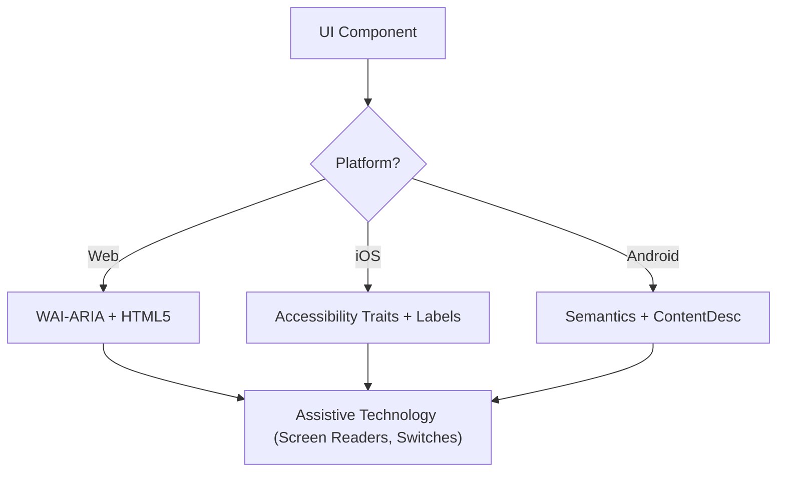

# Accessibility (WCAG 2.2)

本 skill 确保数字界面对所有用户都是 Perceivable、Operable、Understandable 和 Robust（POUR）的，包括使用 screen readers、switch controls 或键盘导航的用户。它聚焦于 WCAG 2.2 success criteria 的技术实现。

## 何时使用

- 为 Web、iOS 或 Android 定义 UI 组件规范。
- 审计现有代码中的 accessibility 障碍或合规缺口。
- 实现新的 WCAG 2.2 标准，如 Target Size (Minimum) 和 Focus Appearance。
- 将高层设计需求映射到技术属性（ARIA roles、traits、hints）。

## 核心概念

- **POUR Principles**：WCAG 的基础（Perceivable、Operable、Understandable、Robust）。
- **Semantic Mapping**：优先使用原生元素而非通用容器，以提供内置的 accessibility。
- **Accessibility Tree**：UI 的表示形式，assistive technologies 实际“读取”的就是它。
- **Focus Management**：控制键盘/screen reader 光标的顺序与可见性。
- **Labeling & Hints**：通过 `aria-label`、`accessibilityLabel` 和 `contentDescription` 提供上下文。

## 工作原理

### Step 1：识别组件角色

确定功能用途（例如，这是一个 button、link 还是 tab？）。在诉诸 custom roles 之前，先使用最具语义化的原生元素。

### Step 2：定义 Perceivable 属性

- 确保文本对比度满足 **4.5:1**（normal）或 **3:1**（large/UI）。
- 为非文本内容（图像、icons）添加文本替代。
- 实现响应式 reflow（支持放大到 400% 而不丢失功能）。

### Step 3：实现 Operable 控件

- 确保最小 **24x24 CSS pixel** 的 target size（WCAG 2.2 SC 2.5.8）。
- 验证所有交互元素均可通过键盘到达，并具有可见的 focus indicator（SC 2.4.11）。
- 为拖拽操作提供 single-pointer 替代方式。

### Step 4：确保 Understandable 逻辑

- 使用一致的导航模式。
- 提供描述性的错误消息和修正建议（SC 3.3.3）。
- 实现“Redundant Entry”（SC 3.3.7）以避免重复索要相同数据。

### Step 5：验证 Robust 兼容性

- 使用正确的 `Name, Role, Value` 模式。
- 为动态状态更新实现 `aria-live` 或 live regions。

## Accessibility 架构图



## 跨平台映射

| 特性               | Web (HTML/ARIA)          | iOS (SwiftUI)                        | Android (Compose)                                           |
| :----------------- | :----------------------- | :----------------------------------- | :---------------------------------------------------------- |
| **主要 Label**     | `aria-label` / `<label>` | `.accessibilityLabel()`              | `contentDescription`                                        |
| **辅助 Hint**      | `aria-describedby`       | `.accessibilityHint()`               | `Modifier.semantics { stateDescription = ... }`             |
| **Action Role**    | `role="button"`          | `.accessibilityAddTraits(.isButton)` | `Modifier.semantics { role = Role.Button }`                 |
| **实时更新**       | `aria-live="polite"`     | `.accessibilityLiveRegion(.polite)`  | `Modifier.semantics { liveRegion = LiveRegionMode.Polite }` |

## 示例

### Web：Accessible 搜索

```html
<form role="search">
  <label for="search-input" class="sr-only">Search products</label>
  <input type="search" id="search-input" placeholder="Search..." />
  <button type="submit" aria-label="Submit Search">
    <svg aria-hidden="true">...</svg>
  </button>
</form>
```

### iOS：Accessible Action Button

```swift
Button(action: deleteItem) {
    Image(systemName: "trash")
}
.accessibilityLabel("Delete item")
.accessibilityHint("Permanently removes this item from your list")
.accessibilityAddTraits(.isButton)
```

### Android：Accessible Toggle

```kotlin
Switch(
    checked = isEnabled,
    onCheckedChange = { onToggle() },
    modifier = Modifier.semantics {
        contentDescription = "Enable notifications"
    }
)
```

## 应避免的 Anti-Patterns

- **Div-Buttons**：使用 `<div>` 或 `<span>` 处理 click 事件，却未添加 role 和键盘支持。
- **Color-Only Meaning**：_仅_ 通过颜色变化来指示错误或状态（例如，将 border 变红）。
- **Uncontained Modal Focus**：未 trap focus 的 Modals，使键盘用户可在 modal 打开时导航到背景内容。Focus 必须 _同时_ 被包含，并可通过 `Escape` 键或显式的关闭按钮退出（WCAG SC 2.1.2）。
- **Redundant Alt Text**：在 alt text 中使用 “Image of...” 或 “Picture of...”（screen readers 已经会播报 “Image” 这一 role）。

## 最佳实践清单

- [ ] 交互元素满足 **24x24px**（Web）或 **44x44pt**（Native）的 target size。
- [ ] Focus indicators 清晰可见且为高对比度。
- [ ] Modals 在打开时 **contain focus**，并在关闭时干净地释放 focus（`Escape` 键或关闭按钮）。
- [ ] Dropdowns 和 menus 在关闭时将 focus 还给触发元素。
- [ ] Forms 提供基于文本的错误建议。
- [ ] 所有 icon-only buttons 均具有描述性的文本 label。
- [ ] 文本缩放时内容能正确 reflow。

## 参考资料

- [WCAG 2.2 Guidelines](https://www.w3.org/TR/WCAG22/)
- [WAI-ARIA Authoring Practices](https://www.w3.org/TR/wai-aria-practices/)
- [iOS Accessibility Programming Guide](https://developer.apple.com/documentation/accessibility)
- [iOS Human Interface Guidelines - Accessibility](https://developer.apple.com/design/human-interface-guidelines/accessibility)
- [Android Accessibility Developer Guide](https://developer.android.com/guide/topics/ui/accessibility)

## 相关 Skills

- `frontend-patterns`
- `design-system`
- `liquid-glass-design`
- `swiftui-patterns`
