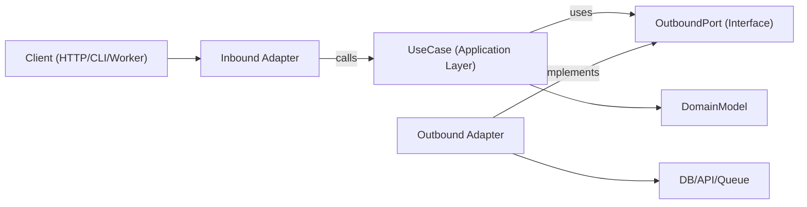

# Hexagonal Architecture

Hexagonal architecture（Ports and Adapters）使业务逻辑独立于框架、传输和持久化细节。核心应用依赖于抽象的 port，而 adapter 在边缘处实现这些 port。

## 何时使用

- 构建长期可维护性和可测试性至关重要的新功能。
- 重构 domain 逻辑与 I/O 关注点混杂的分层式或框架繁重的代码。
- 为同一 use case 支持多种接口（HTTP、CLI、queue worker、cron job）。
- 在不重写业务规则的前提下替换基础设施（数据库、外部 API、message bus）。

当请求涉及边界、以 domain 为中心的设计、重构紧耦合的服务，或将应用逻辑与特定 library 解耦时，使用此 skill。

## 核心概念

- **Domain model**：业务规则以及 entity/value object。不导入任何框架。
- **Use case（应用层）**：编排 domain 行为与工作流步骤。
- **Inbound port**：描述应用能做什么的契约（command/query/use-case 接口）。
- **Outbound port**：应用所需依赖的契约（repository、gateway、event publisher、clock、UUID 等）。
- **Adapter**：port 的基础设施与交付实现（HTTP controller、DB repository、queue consumer、SDK wrapper）。
- **Composition root**：将具体 adapter 绑定到 use case 的单一装配位置。

Outbound port 接口通常位于应用层（或当抽象真正属于 domain 层级时位于 domain 中），而基础设施 adapter 负责实现它们。

依赖方向始终向内：

- Adapters -> application/domain
- Application -> port 接口（inbound/outbound 契约）
- Domain -> domain-only 抽象（无 framework 或基础设施依赖）
- Domain -> 无外部依赖

## 工作原理

### Step 1：建模 use case 边界

为单个 use case 定义清晰的输入与输出 DTO。将传输细节（Express 的 `req`、GraphQL 的 `context`、job payload wrapper）排除在此边界之外。

### Step 2：先定义 outbound port

将每个 side effect 识别为一个 port：

- 持久化（`UserRepositoryPort`）
- 外部调用（`BillingGatewayPort`）
- 横切关注（`LoggerPort`、`ClockPort`）

Port 应当建模能力，而非技术。

### Step 3：以纯编排实现 use case

Use case 的 class/function 通过 constructor/argument 接收 port。它验证应用级别的 invariant，协调 domain 规则，并返回普通数据结构。

### Step 4：在边缘构建 adapter

- Inbound adapter 将协议输入转换为 use-case 输入。
- Outbound adapter 将应用契约映射到具体的 API/ORM/query builder。
- 映射保留在 adapter 中，而非 use case 内部。

### Step 5：在 composition root 中装配一切

实例化 adapter，然后将其注入到 use case 中。将此装配集中化，以避免隐式的 service-locator 行为。

### Step 6：按边界进行测试

- 使用 fake port 对 use case 进行 unit test。
- 使用真实 infra 依赖对 adapter 进行 integration test。
- 通过 inbound adapter 对面向用户的流程进行 E2E test。

## 架构图



## 建议的模块布局

采用 feature-first 的组织方式，并设置显式边界：

```text
src/
  features/
    orders/
      domain/
        Order.ts
        OrderPolicy.ts
      application/
        ports/
          inbound/
            CreateOrder.ts
          outbound/
            OrderRepositoryPort.ts
            PaymentGatewayPort.ts
        use-cases/
          CreateOrderUseCase.ts
      adapters/
        inbound/
          http/
            createOrderRoute.ts
        outbound/
          postgres/
            PostgresOrderRepository.ts
          stripe/
            StripePaymentGateway.ts
      composition/
        ordersContainer.ts
```

## TypeScript 示例

### Port 定义

```typescript
export interface OrderRepositoryPort {
  save(order: Order): Promise<void>;
  findById(orderId: string): Promise<Order | null>;
}

export interface PaymentGatewayPort {
  authorize(input: { orderId: string; amountCents: number }): Promise<{ authorizationId: string }>;
}
```

### Use case

```typescript
type CreateOrderInput = {
  orderId: string;
  amountCents: number;
};

type CreateOrderOutput = {
  orderId: string;
  authorizationId: string;
};

export class CreateOrderUseCase {
  constructor(
    private readonly orderRepository: OrderRepositoryPort,
    private readonly paymentGateway: PaymentGatewayPort
  ) {}

  async execute(input: CreateOrderInput): Promise<CreateOrderOutput> {
    const order = Order.create({ id: input.orderId, amountCents: input.amountCents });

    const auth = await this.paymentGateway.authorize({
      orderId: order.id,
      amountCents: order.amountCents,
    });

    // markAuthorized 返回一个新的 Order 实例；它不会原地 mutate。
    const authorizedOrder = order.markAuthorized(auth.authorizationId);
    await this.orderRepository.save(authorizedOrder);

    return {
      orderId: order.id,
      authorizationId: auth.authorizationId,
    };
  }
}
```

### Outbound adapter

```typescript
export class PostgresOrderRepository implements OrderRepositoryPort {
  constructor(private readonly db: SqlClient) {}

  async save(order: Order): Promise<void> {
    await this.db.query(
      "insert into orders (id, amount_cents, status, authorization_id) values ($1, $2, $3, $4)",
      [order.id, order.amountCents, order.status, order.authorizationId]
    );
  }

  async findById(orderId: string): Promise<Order | null> {
    const row = await this.db.oneOrNone("select * from orders where id = $1", [orderId]);
    return row ? Order.rehydrate(row) : null;
  }
}
```

### Composition root

```typescript
export const buildCreateOrderUseCase = (deps: { db: SqlClient; stripe: StripeClient }) => {
  const orderRepository = new PostgresOrderRepository(deps.db);
  const paymentGateway = new StripePaymentGateway(deps.stripe);

  return new CreateOrderUseCase(orderRepository, paymentGateway);
};
```

## 多语言映射

在不同生态系统中使用相同的边界规则；只有语法和装配风格有所差异。

- **TypeScript/JavaScript**
  - Port：以 `application/ports/*` 作为接口/类型。
  - Use case：带有 constructor/argument 注入的 class/function。
  - Adapter：`adapters/inbound/*`、`adapters/outbound/*`。
  - Composition：显式的 factory/container module（无隐藏的全局变量）。
- **Java**
  - Package：`domain`、`application.port.in`、`application.port.out`、`application.usecase`、`adapter.in`、`adapter.out`。
  - Port：位于 `application.port.*` 的接口。
  - Use case：普通 class（Spring 的 `@Service` 为可选，非必需）。
  - Composition：Spring config 或手动装配的 class；将装配保持在 domain/use-case class 之外。
- **Kotlin**
  - Module/package 映射 Java 的划分方式（`domain`、`application.port`、`application.usecase`、`adapter`）。
  - Port：Kotlin 接口。
  - Use case：带有 constructor 注入的 class（Koin/Dagger/Spring/手动）。
  - Composition：module 定义或专门的 composition function；避免 service locator 模式。
- **Go**
  - Package：`internal/<feature>/domain`、`application`、`ports`、`adapters/inbound`、`adapters/outbound`。
  - Port：由消费方 application package 拥有的小型接口。
  - Use case：带有接口字段以及显式 `New...` constructor 的 struct。
  - Composition：在 `cmd/<app>/main.go`（或专门的装配 package）中进行装配，保持 constructor 显式。

## 需要避免的反模式

- Domain entity 导入 ORM model、web framework 类型或 SDK client。
- Use case 直接读取 `req`、`res` 或 queue metadata。
- 从 use case 直接返回数据库行，而不进行 domain/application 映射。
- 让 adapter 之间直接相互调用，而非通过 use-case port 流转。
- 将依赖装配分散到多个文件中，并使用隐藏的全局 singleton。

## 迁移手册

1. 选择一个存在频繁变更痛点的 vertical slice（单个 endpoint/job）。
2. 提取具有显式 input/output 类型的 use-case 边界。
3. 围绕现有的基础设施调用引入 outbound port。
4. 将编排逻辑从 controller/service 移入 use case 中。
5. 保留旧 adapter，但让它们委托给新的 use case。
6. 围绕新边界添加测试（unit + adapter integration）。
7. 逐 slice 重复此过程；避免完全重写。

### 重构现有系统

- **Strangler approach**：保留当前 endpoint，每次让一个 use case 通过新的 port/adapter 进行路由。
- **避免 big-bang 重写**：按 feature slice 进行迁移，并通过 characterization test 保持行为不变。
- **Facade 优先**：在替换内部实现之前，先将遗留服务封装到 outbound port 之后。
- **Composition 冻结**：尽早集中化装配，使新依赖不会泄漏到 domain/use-case 层。
- **Slice 选择规则**：优先选择高频变更、低爆炸半径的流程。
- **回滚路径**：在每个迁移后的 slice 上保留可逆的 toggle 或路由切换，直到生产环境行为得到验证。

## 测试指南（相同的 Hexagonal 边界）

- **Domain 测试**：将 entity/value object 作为纯业务规则进行测试（无 mock，无 framework 设置）。
- **Use-case unit test**：使用针对 outbound port 的 fake/stub 测试编排；断言业务结果与 port 交互。
- **Outbound adapter contract test**：在 port 层级定义共享的 contract suite，并针对每个 adapter 实现运行它们。
- **Inbound adapter 测试**：验证协议映射（将 HTTP/CLI/queue payload 映射为 use-case input，并将 output/error 映射回协议）。
- **Adapter integration test**：针对真实基础设施（DB/API/queue）运行，以验证序列化、schema/query 行为、retry 与 timeout。
- **End-to-end 测试**：覆盖经由 inbound adapter -> use case -> outbound adapter 的关键用户旅程。
- **Refactor 安全性**：在提取之前添加 characterization test；保留它们直到新的边界行为稳定且等效。

## 最佳实践清单

- Domain 与 use-case 层仅导入内部类型和 port。
- 每个外部依赖都由一个 outbound port 表示。
- 校验发生在边界处（inbound adapter + use-case invariant）。
- 使用 immutable 转换（返回新的 value/entity，而非 mutate 共享状态）。
- 错误跨边界转换（infra error -> application/domain error）。
- Composition root 是显式的且易于审计。
- Use case 可通过针对 port 的简单 in-memory fake 进行测试。
- Refactor 从一个 vertical slice 开始，并配备保持行为的测试。
- 语言/framework 的特定细节保留在 adapter 中，绝不进入 domain 规则。
