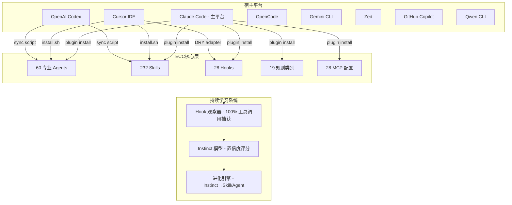
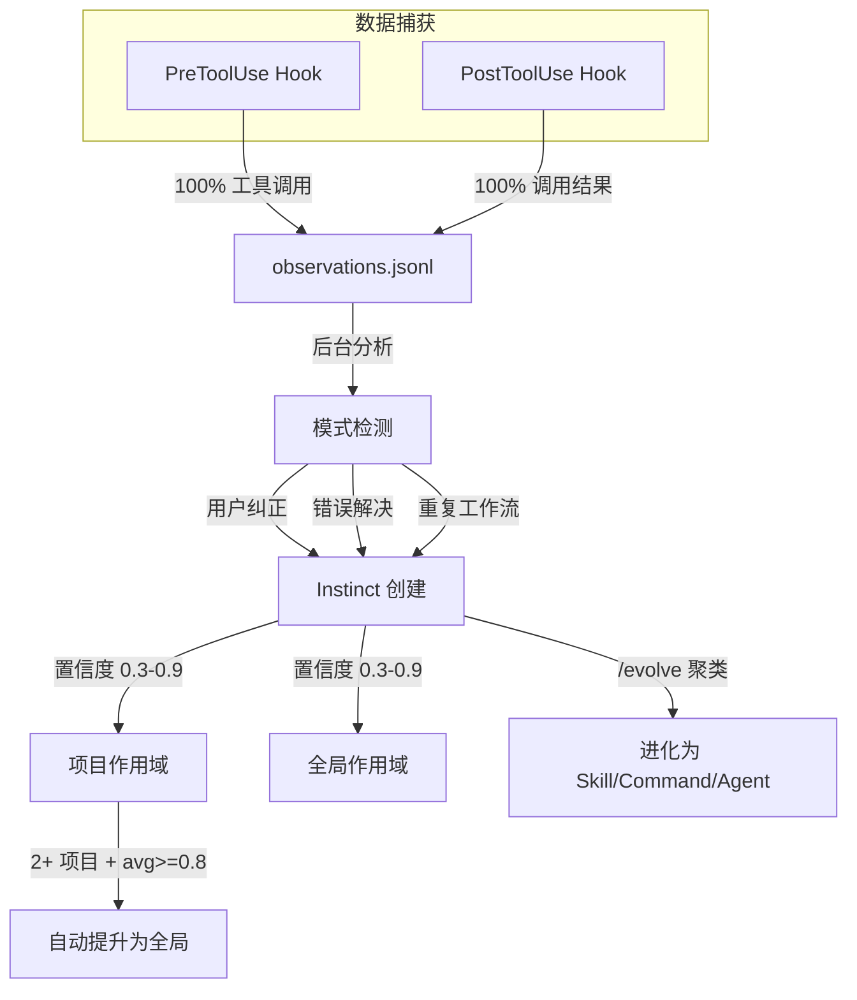

# Everything Claude Code (ECC) 深度剖析

> 本文档帮助你快速理解项目的核心思想、架构设计和技术决策。

## 核心思想

ECC 是一个面向 AI 编码 Agent 的"操作系统级"插件——它不提供单一功能，而是通过 60 个专业 Agent、232 个 Skill、28 个 Hook 和 19 个规则类别，将 Claude Code（以及 Cursor、Codex、OpenCode 等 10 个平台）改造成一个具备 TDD 工作流、安全审查、持续学习和自主循环能力的"编码操作系统"。

## 整体架构

ECC 的架构围绕四个核心抽象展开：**Agent**（专业分工人）、**Skill**（工作流知识）、**Hook**（自动化触发器）和 **Rule**（约束规则）。它们通过宿主平台的插件机制注入，在运行时由宿主 Agent 按上下文自动调度。



### Skill 清单

ECC 的 232 个 Skill 按功能分为 9 大类别（见 `CONTRIBUTING.md` Skill Categories 和 `skills/` 目录）：

| 类别 | 数量 | 代表性 Skill | 触发场景 |
|------|------|-------------|---------|
| 语言标准 | 25 | `coding-standards`, `python-patterns`, `golang-patterns`, `rust-patterns`, `kotlin-patterns`, `swiftui-patterns` | 编写特定语言代码时 |
| 框架模式 | 40 | `backend-patterns`, `frontend-patterns`, `django-patterns`, `springboot-patterns`, `nestjs-patterns`, `angular-developer` | 使用特定框架开发时 |
| 工作流 | 20 | `tdd-workflow`, `verification-loop`, `continuous-learning-v2`, `autonomous-loops`, `strategic-compact` | 执行特定开发流程时 |
| 领域知识 | 30 | `security-review`, `api-design`, `database-migrations`, `docker-patterns`, `mcp-server-patterns`, `mle-workflow` | 处理特定技术领域时 |
| 工具集成 | 15 | `deep-research`, `search-first`, `exa-search`, `documentation-lookup`, `fal-ai-media` | 需要外部工具辅助时 |
| 运营/商业 | 20 | `brand-voice`, `content-engine`, `market-research`, `investor-materials`, `article-writing`, `x-api` | 内容创作和市场运营 |
| 基础设施/运维 | 15 | `github-ops`, `email-ops`, `terminal-ops`, `cost-tracking`, `token-budget-advisor` | DevOps 和日常运维 |
| Agent 架构 | 10 | `agent-architecture-audit`, `agent-harness-construction`, `agent-introspection-debugging`, `agentic-engineering`, `agentic-os` | 构建和审计 Agent 自身 |
| 专项领域 | 30 | `network-bgp-diagnostics`, `healthcare-phi-compliance`, `defi-amm-security`, `clickhouse-io`, `scientific-thinking-literature-review` | 特定行业/技术场景 |

> 数据来源：`skills/` 目录实际计数 232 个子目录，与 `manifest.json` 中 `components.skills: 232` 一致。

### 核心工作流编排

ECC 的 Skill 并非孤立存在，而是通过 Agent 编排策略串联为端到端工作流：

```mermaid
graph LR
    A[用户请求] --> B{复杂度判断}
    B -->|复杂功能| C[planner Agent]
    B -->|简单修改| D[tdd-guide Agent]
    
    C -->|Phase 1: 架构审查| E[search-first Skill]
    E -->|调研已有方案| F[architect Agent]
    F -->|设计决策| G[Implementation Plan]
    
    G --> H[tdd-workflow Skill]
    H -->|RED: 写测试| I[测试失败]
    I -->|GREEN: 实现| J[测试通过]
    J -->|REFACTOR| K[重构优化]
    
    K --> L[code-reviewer Agent]
    L -->|审查| M{安全问题?}
    M -->|是| N[security-reviewer Agent]
    M -->|否| O[verification-loop Skill]
    
    N --> O
    O -->|build+test+lint| P[提交代码]
    
    Q[continuous-learning-v2] -.->|Hook 自动观察| A
```



**典型工作流链**（见 `AGENTS.md` Development Workflow）：
1. **Plan** — planner Agent 分析需求、分解步骤、识别风险
2. **TDD** — tdd-guide Agent 驱动 RED→GREEN→REFACTOR 循环
3. **Review** — code-reviewer Agent 审查代码质量
4. **Security** — security-reviewer Agent 检查安全漏洞
5. **Verify** — verification-loop Skill 运行 build+test+lint
6. **Commit** — 按 conventional commits 格式提交

### 跨平台适配

ECC 支持的 10 个平台通过不同的适配策略实现功能覆盖（见 `platform_adapters.json` 和各适配器目录）：

| 平台 | 适配器路径 | 功能覆盖 | 安装方式 | 特殊说明 |
|------|-----------|---------|---------|---------|
| **Claude Code** | `.claude-plugin/` | 全功能（Agent/Skill/Hook/Rule/MCP） | `/plugin install ecc@ecc` | 主平台，功能最完整 |
| **Cursor IDE** | `.cursor/` | 全功能 | `./install.sh --target cursor` | DRY adapter 模式复用 Hook 脚本 |
| **OpenAI Codex** | `.codex/` | Agent/Skill/Rule/MCP（无 Hook） | `scripts/sync-ecc-to-codex.sh` | 通过 AGENTS.md 指令层替代 Hook |
| **OpenCode** | `.opencode/` | 全功能 + 自定义工具（6个） | `npm install ecc-universal` | 支持 custom_tools API |
| **Gemini CLI** | `.gemini/` | 仅 Rule | `.gemini/GEMINI.md` | 实验性支持，功能有限 |
| **Zed** | `.zed/` | Agent/Skill/Command/Rule（无 Hook） | `./install.sh --target zed` | 最小化安装 |
| **GitHub Copilot** | `.github/` | 仅 Rule/Prompt | 自动检测 `.github/copilot-instructions.md` | 无 Hook 或子 Agent API |
| **Qwen CLI** | `.qwen/` | Agent/Skill/Command/Rule | 主目录选择性安装 | |

**DRY 适配器模式**（见 `platform_adapters.json` dry_adapter_pattern）：Cursor 等平台的 Hook 通过 `.cursor/hooks/adapter.js` 将其 stdin JSON 格式转换为 Claude Code 格式，使得 `scripts/hooks/*.js` 可以在所有平台复用，无需为每个平台重写 Hook 逻辑。

### Hook 自动化系统

ECC 的 28 个 Hook 覆盖 7 种事件类型（见 `hooks/hooks.json`），形成了一个完整的生命周期自动化体系：

| 事件类型 | Hook 数量 | 关键 Hook | 职责 |
|---------|----------|----------|------|
| **PreToolUse** | 8 | `pre:bash:dispatcher`, `pre:config-protection`, `pre:observe:continuous-learning` | 工具调用前拦截：质量检查、配置保护、治理捕获、GateGuard 事实强制 |
| **PostToolUse** | 10 | `post:quality-gate`, `post:observe:continuous-learning`, `post:ecc-context-monitor` | 工具调用后处理：质量门禁、持续学习观察、上下文监控、编辑累积器 |
| **PostToolUseFailure** | 1 | `post:mcp-health-check` | MCP 调用失败时标记不健康的服务器 |
| **PreCompact** | 1 | `pre:compact` | 上下文压缩前保存状态 |
| **SessionStart** | 1 | `session:start` | 新会话加载历史上下文、检测包管理器 |
| **Stop** | 6 | `stop:format-typecheck`, `stop:evaluate-session`, `stop:cost-tracker`, `stop:desktop-notify` | 响应结束时批量格式化、评估会话、跟踪成本、桌面通知 |
| **SessionEnd** | 1 | `session:end:marker` | 会话结束生命周期标记 |

**运行时控制**（见 `hook_mechanism.json` runtime_controls）：
- `ECC_HOOK_PROFILE`：`minimal`（无 Hook）/ `standard`（默认）/ `strict`（全量）
- `ECC_DISABLED_HOOKS`：逗号分隔的 Hook ID 禁用列表
- 所有 Hook 通过 `run-with-flags.js` 包装器统一路由，支持 profile 和 disabled 过滤

**关键设计决策**：Hook 的 bootstrap 机制通过内联的 `plugin-hook-bootstrap.js` 解析逻辑自动定位 `CLAUDE_PLUGIN_ROOT`——依次检查环境变量、已知插件路径、缓存目录，确保在不同安装方式下都能找到脚本（见 `hooks/hooks.json` 中每个 Hook 的 command 字段）。

### 方法论/哲学

ECC 的核心方法论记录在 `SOUL.md` 和 `RULES.md` 中，可以概括为五条原则：

| 原则 | 含义 | 代码体现 |
|------|------|---------|
| **Agent-First** | 尽早将工作路由到专业 Agent | AGENTS.md 明确了何时调用 planner、code-reviewer、security-reviewer 等 |
| **Skills-First** | Skill 是工作流的首要入口 | "skills/ is the canonical workflow surface"（AGENTS.md Workflow Surface Policy） |
| **Test-Driven** | 测试先行，覆盖率 80%+ | `tdd-workflow` Skill 强制 RED→GREEN→REFACTOR 循环 |
| **Security-First** | 安全不可妥协 | `security-review` Skill、`rules/common/security.md`、`pre:governance-capture` Hook |
| **Plan Before Execute** | 复杂变更先规划再执行 | planner Agent 输出结构化 Implementation Plan |

**反模式清单**（见 `methodology.json` anti_patterns）：
- 不搜索已有方案就直接写代码（应使用 search-first Skill）
- 忽略已有的 MCP 服务器能力
- 同时使用多种安装方法（plugin + 手动安装器叠加）
- 一次性启用所有 MCP 服务器（每个消耗上下文窗口 token）
- 用负面指令替代独立清理步骤（应使用 de-sloppify 模式）

### 持续学习系统（Continuous Learning v2.1）

ECC 最具差异化的特性之一是基于 Instinct 模型的持续学习系统（见 `skills/continuous-learning-v2/SKILL.md`）：



**Instinct 数据模型**：
- **原子性**：一个触发条件 → 一个动作
- **置信度加权**：0.3（试探）→ 0.5（中等）→ 0.7（强）→ 0.9（核心）
- **作用域隔离**：项目级 Instinct（如 "使用 React Hooks"）默认只在该项目生效；通用模式（如 "始终验证输入"）为全局
- **自动提升**：当同一 Instinct 在 2+ 个项目中出现且平均置信度 >= 0.8 时，自动提升为全局

**v2.1 vs v2.0 的关键改进**（见 SKILL.md What's New）：
- 存储路径从 `~/.claude/homunculus/` 迁移到 `${XDG_DATA_HOME:-~/.local/share}/ecc-homunculus/`，避免 Claude Code 敏感路径守卫阻止后台写入
- 项目检测基于 git remote URL 哈希，确保同一仓库在不同机器上获得相同 ID
- 新增 `/promote` 和 `/projects` 命令

## 核心逻辑

### 安装注入流程

ECC 提供了 6 种安装方式（见 `host_interaction.json` installation_methods），以 Claude Code 插件方式为例：

```
1. /plugin marketplace add https://github.com/affaan-m/ECC
2. /plugin install ecc@ecc
3. Claude Code 加载 .claude-plugin/plugin.json → 注册 skills/ 和 commands/
4. hooks/hooks.json 自动注入到宿主的 Hook 系统
5. SessionStart Hook 触发 → 加载历史上下文 + 检测包管理器
6. 后续所有工具调用被 PreToolUse/PostToolUse Hook 拦截
```

**重要约束**：Claude Code 插件无法自动分发规则文件，需手动执行 `cp -R rules/<category> ~/.claude/rules/ecc/`（见 `host_interaction.json` rules_installation）。规则类别有 19 个：common、typescript、python、golang、swift、php、arkts、cpp、java、kotlin、rust、ruby、angular、dart、fsharp、csharp、perl、web、zh。

### Agent 编排策略

60 个 Agent 按职责分为以下几类（见 `AGENTS.md` Available Agents）：

| 类别 | Agent 示例 | 触发时机 |
|------|-----------|---------|
| 规划 | planner, architect | 复杂功能、架构决策 |
| 质量 | code-reviewer, refactor-cleaner | 代码修改后、维护清理 |
| 安全 | security-reviewer | 涉及安全敏感代码 |
| 测试 | tdd-guide, e2e-runner | 新功能、Bug 修复、关键流程 |
| 构建 | build-error-resolver, cpp-build-resolver, go-build-resolver, rust-build-resolver | 构建失败时 |
| 语言专家 | python-reviewer, go-reviewer, rust-reviewer, typescript-reviewer, java-reviewer, kotlin-reviewer, django-reviewer | 对应语言项目 |
| 运维 | loop-operator, harness-optimizer | 自主循环、配置优化 |
| ML | mle-reviewer, pytorch-build-resolver | ML 管道、PyTorch 问题 |

**主动编排原则**（见 `AGENTS.md` Agent Orchestration）：
- 不等待用户指示，根据上下文主动调用专业 Agent
- 复杂功能 → planner，代码变更 → code-reviewer，Bug 修复 → tdd-guide
- 独立操作可并行执行多个 Agent

### Skill 执行流程（以 tdd-workflow 为例）

```
1. 激活条件匹配：用户请求新功能/Bug 修复/重构
2. Step 1: 写用户旅程（As a [role], I want to [action]）
3. Step 2: 为每个用户旅程生成测试用例
4. Step 3: 运行测试 → 必须 FAIL（RED 门禁）
   - 验证：测试编译成功 + 实际执行 + 因业务逻辑失败
   - Git checkpoint: test: add reproducer for <feature>
5. Step 4: 写最小实现使测试通过
6. Step 5: 重新运行测试 → 必须 PASS（GREEN 门禁）
   - Git checkpoint: fix: <feature>
7. Step 6: 重构优化（保持测试通过）
   - Git checkpoint: refactor: clean up after <feature>
8. Step 7: 验证覆盖率 80%+
```

> 流程来源：`skills/tdd-workflow/SKILL.md` TDD Workflow Steps，含 Git checkpoint 机制和严格的 RED/GREEN 验证要求。

## 最大价值

1. **开箱即用的专业工作流**：无需从零配置 TDD、安全审查、代码审查等流程。232 个 Skill 覆盖 9 大类别，从语言标准（25 个）到专项领域（30 个），开发者无需自己编写 Agent 提示词。安装后 `tdd-workflow`、`search-first`、`security-review` 等工作流立即可用。

2. **Hook 驱动的确定性自动化**：不同于 Skill 的概率性触发（约 50-80%），Hook 在每次工具调用时 100% 触发。这意味着质量门禁、配置保护、持续学习观察不会遗漏。28 个 Hook 形成"安全网"，即使 Agent 判断失误也能兜底。

3. **持续学习让 Agent 越用越好**：Continuous Learning v2.1 通过 Instinct 模型（原子行为 + 置信度评分 + 项目作用域）将每次会话的工作模式转化为可复用知识。React 模式不会污染 Python 项目，通用模式（如"始终验证输入"）在 2+ 项目出现后自动提升为全局。

## 适用场景

- **团队标准化编码流程**：当你需要确保团队所有成员的 Claude Code 会话都遵循 TDD、安全审查、代码审查流程时。ECC 的 Hook 机制提供确定性保证，Skill 提供一致的工作流指导。
- **多语言/多框架项目**：当项目涉及 TypeScript + Python + Go + Rust 等多语言栈时，ECC 的 25 个语言标准 Skill 和 40 个框架模式 Skill 提供了针对性的最佳实践，无需为每种语言单独配置。
- **跨 IDE 协作**：当团队成员使用不同 IDE（Claude Code、Cursor、Copilot）时，ECC 通过 DRY 适配器模式确保在所有平台上获得一致的工作流体验。

## 不适用场景

- **只需要单一功能的轻量用户**：如果你只需要 TDD 工作流或安全审查，安装整个 ECC 插件（232 个 Skill、28 个 Hook）会带来不必要的上下文窗口消耗。建议直接复制所需的单个 Skill 文件。
- **对 Hook 开销敏感的场景**：每个工具调用都会触发多个 Hook（pre + post），在低性能环境或对延迟极度敏感的场景中可能造成可感知的响应延迟。可通过 `ECC_HOOK_PROFILE=minimal` 降低开销。
- **非 Claude Code 为主的用户**：在 Gemini CLI、GitHub Copilot 等平台上功能覆盖有限（仅 Rule），无法体验 Hook、Agent 编排等核心能力。

## 优点

- **规模与覆盖面**：232 个 Skill 覆盖了从 Python 到 Cisco IOS、从 Django 到 DeFi AMM 安全的广泛领域，是同类项目中组件数量最多的（对比 superpowers 约 50 个 Skill、gstack 约 30 个 Skill）。数据来源：`package.json` files 字段列出 232 个 skill 子目录。
- **确定性的 Hook 自动化**：28 个 Hook 在 7 个生命周期节点提供质量门禁、配置保护、学习观察等自动化。Hook 通过 `run-with-flags.js` 包装器支持 profile 分级和 selective disable，兼顾严格性和灵活性。来源：`hooks/hooks.json` 完整定义。
- **DRY 跨平台适配**：通过 adapter.js 将 Cursor 等平台的 Hook 协议转换为 Claude Code 格式，复用同一套 `scripts/hooks/*.js` 脚本，避免为每个平台维护独立的 Hook 实现。来源：`platform_adapters.json` dry_adapter_pattern。
- **代码质量标准**：所有 Hook 脚本使用 CommonJS、200 行以下、`exit 0` on non-critical error 的规范（见 `.claude/rules/node.md` Hook Development）。测试覆盖要求 80%（见 `package.json` coverage 脚本）。
- **Instinct-based 持续学习**：v2.1 的项目作用域隔离解决了跨项目污染问题，置信度评分机制提供了可调的信任级别，自动提升机制避免了手动管理全局知识。来源：`skills/continuous-learning-v2/SKILL.md`。

## 缺点

- **安装复杂度和碎片化**：6 种安装方式（Plugin / npm / Shell / PowerShell / npx / Manual Copy），不同方式的功能覆盖不同（如 Plugin 方式不能自动分发 Rule），用户需要理解哪种方式适合自己的场景。多安装方式叠加（如 Plugin + Manual）会导致重复执行和路径冲突（`hooks/hooks.json` 的 bootstrap 逻辑需搜索多个路径）。
- **上下文窗口消耗**：232 个 Skill 的元数据和 60 个 Agent 的描述文本在会话启动时占用上下文窗口。即使 Agent 按需加载，Hook 和 Rule 始终存在。`methodology.json` 中明确警告"避免上下文窗口最后 20%"。每个启用的 MCP 服务器也会消耗 token。
- **平台功能不一致**：在 10 个支持平台中，只有 Claude Code 和 Cursor 实现了全功能覆盖。Codex 无 Hook、Gemini CLI 仅 Rule、GitHub Copilot 仅 Rule/Prompt。这导致跨平台用户在不同 IDE 中体验差异显著。来源：`platform_adapters.json` 各平台的 features 字段。
- **Hook bootstrap 内联代码膨胀**：每个 Hook 的 command 字段包含约 500 字符的内联 JavaScript 用于定位 `CLAUDE_PLUGIN_ROOT`（检查环境变量 → 已知路径 → 缓存目录）。这段逻辑在每个 Hook 中重复，增加了 `hooks.json` 的体积（354 行）和维护负担。

## 技术栈

| 类别 | 技术 | 用途 | 出处 |
|------|------|------|------|
| 语言 | JavaScript (CommonJS) | Hook 脚本、安装器、CLI 工具 | `.claude/rules/node.md` 明确要求 CommonJS only |
| 语言 | Python | 持续学习 CLI、Dashboard | `skills/continuous-learning-v2/instinct-cli.py`, `ecc_dashboard.py` |
| 语言 | TypeScript（类型检查） | 开发时类型检查 | `package.json` devDependencies `typescript@^6.0.3` |
| 语言 | Markdown + YAML frontmatter | Agent、Skill、Command 定义 | `CONTRIBUTING.md` Agent/Skill 模板 |
| 运行时 | Node.js >=18 | 所有脚本运行环境 | `package.json` engines 字段 |
| 包管理 | yarn@4.9.2 + npm | 项目依赖管理 | `package.json` packageManager 字段 |
| 测试 | Node.js assert (自定义 runner) | 单元/集成测试 | `package.json` test 脚本 `node tests/run-all.js` |
| 覆盖率 | c8 | 代码覆盖率 | `package.json` coverage 脚本 |
| 代码检查 | ESLint + markdownlint-cli | JS 和 Markdown 代码检查 | `package.json` lint 脚本 |
| 主要依赖 | ajv@^8.18.0 | JSON Schema 验证 | `package.json` dependencies |
| 主要依赖 | @iarna/toml@^2.2.5 | TOML 配置解析（用于 Codex 适配） | `package.json` dependencies |
| CI/CD | GitHub Actions | 自动化验证流水线 | `.github/workflows/`（12 项 CI 检查） |

## 同类项目对比

ECC 在 AI 编码 Agent 增强插件领域中处于"广度优先"的位置。以下是与其他同类项目的对比：

| 特性 | ECC | superpowers | gstack | OpenSpec |
|------|-----|------------|--------|----------|
| **核心定位** | Agent 操作系统：多平台、全生命周期 | Claude Code 技能包：单平台、工作流增强 | Claude Code 插件：结构化任务管理 | 开源项目分析器 |
| **Skill 数量** | 232 | ~50 | ~30 | 3 类文档模板 |
| **Agent 数量** | 60 | ~10 | ~5 | 0 |
| **Hook 数量** | 22 | ~5 | ~3 | 0 |
| **支持平台** | 10 | 1 (Claude Code) | 1 (Claude Code) | 1 (Claude Code) |
| **持续学习** | v2.1 Instinct 模型 | 无 | 无 | 无 |
| **跨平台适配** | DRY adapter 模式 | 无 | 无 | 无 |
| **安装方式** | 6 种 | 1 种（手动复制） | 1 种（手动复制） | 1 种（npm） |
| **社区规模** | 170+ 贡献者 | ~10 贡献者 | ~5 贡献者 | ~3 贡献者 |
| **npm 包名** | ecc-universal | — | — | openspec-analyzer |

**ECC 的独特性**：
- 唯一提供 10 个平台适配的 AI 编码 Agent 插件
- 唯一内置持续学习系统（Instinct 模型 + 置信度评分 + 项目作用域）
- 唯一提供 28 个 Hook 的确定性自动化（其他项目 Hook 数量 <5）
- Skill 数量是同类项目的 4-7 倍

**ECC 的代价**：
- 复杂度远高于同类项目（complexity_score 30.7，exhaustive 级别）
- 安装配置选项多，学习曲线陡峭
- 上下文窗口消耗显著大于轻量级替代品

---

*本文档由开源项目分析器自动生成，最后更新：2026-06-06*
